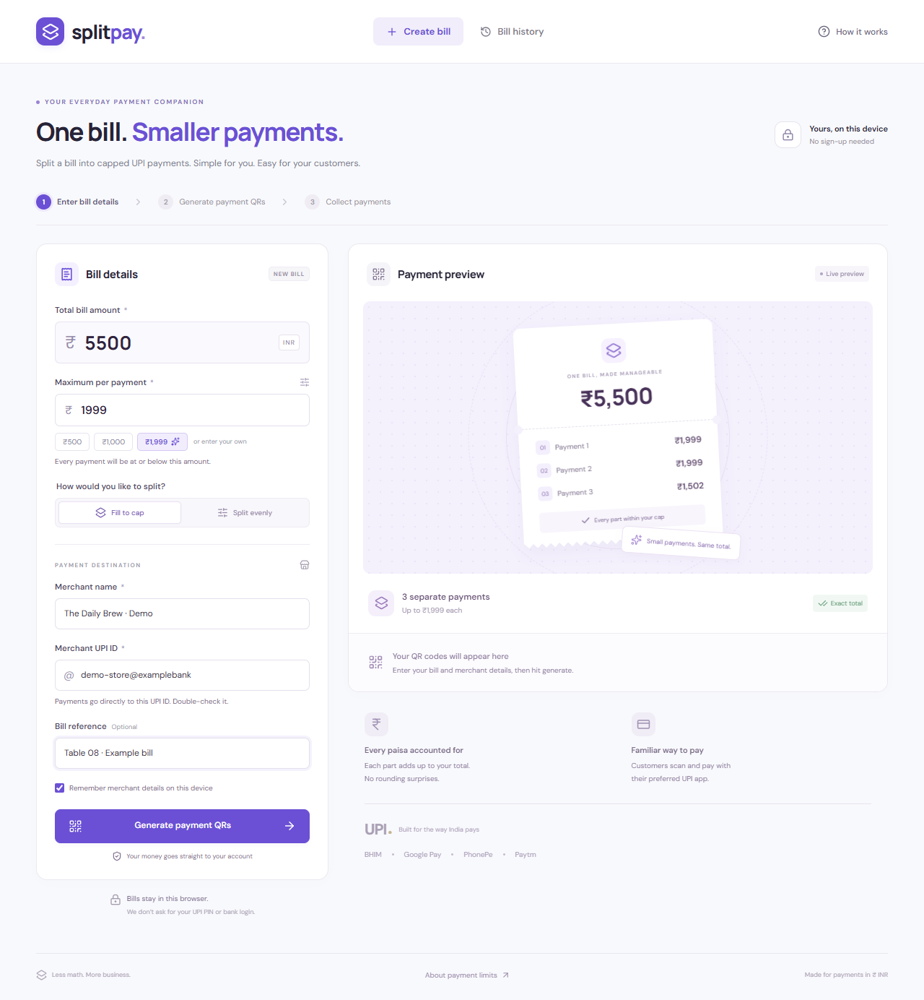
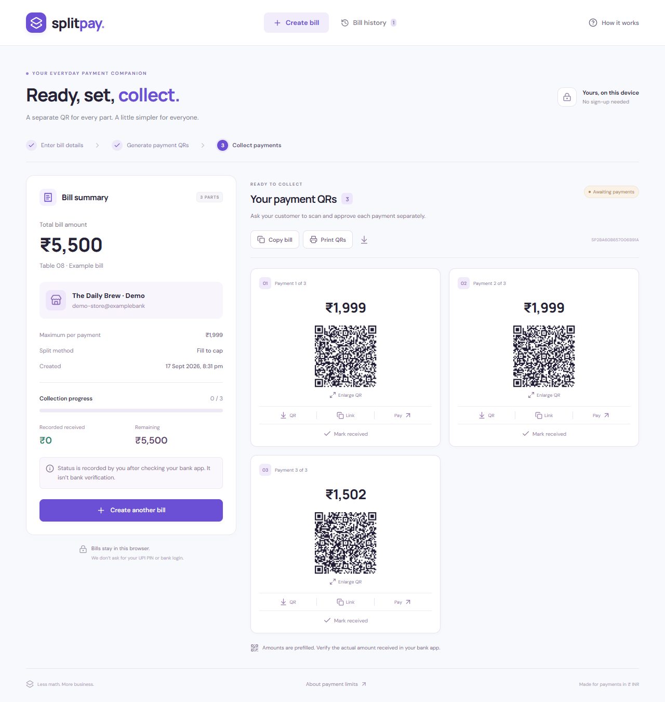
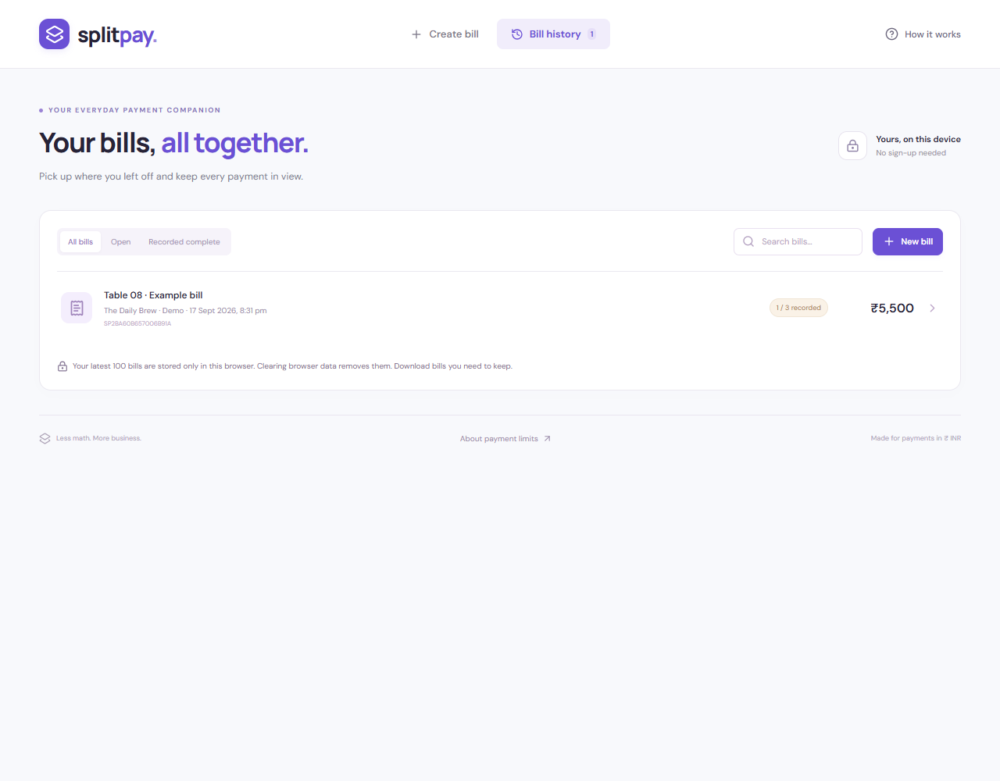
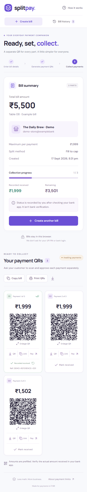
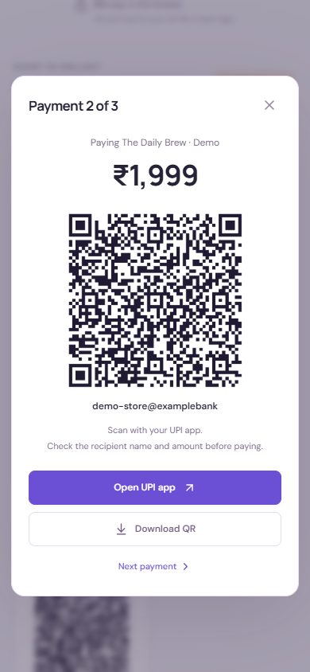

<p align="center">
  
</p>

<h1 align="center">SplitPay</h1>

<p align="center"><strong>One bill. Smaller payments.</strong><br />A free-to-use UPI bill splitter for merchants, built for desktop and mobile.</p>

<p align="center">
  <a href="https://github.com/sanket29395/splitpay/actions/workflows/ci.yml">
    
  </a>
  <a href="LICENSE">
    
  </a>
  
</p>

<p align="center">
  <a href="https://splitpay-cbf11.web.app">🚀 Use SplitPay</a> ·
  <a href="#features">Features</a> ·
  <a href="#screenshots">Screenshots</a> ·
  <a href="#run-locally">Run locally</a> ·
  <a href="docs/FIREBASE_HOSTING.md">Deploy to Firebase</a> ·
  <a href="CONTRIBUTING.md">Contribute</a>
</p>



Enter a bill total, set the maximum per payment, and add your merchant UPI ID. SplitPay creates a separate **UPI QR code and payment link for each part**, while keeping the total exact to the paisa.

**No sign-up, no backend, no payment-provider credentials.** QR codes, fonts, and bill calculations run locally in the browser.

## Features

- **Choose your cap.** The default ₹1,999 keeps generated amounts below ₹2,000; enter any supported maximum.
- **Two split methods.** Fill each payment to the cap, or split evenly with at most one paisa difference.
- **Scan or tap to pay.** Each part has its own UPI QR, prefilled amount, and transaction reference.
- **Share and print.** Copy payment links, download QR PNGs or a text bill, and print the complete set of QRs.
- **Track collections.** Record received payments and optional bank references after checking your bank app.
- **Pick up later.** Search and reopen the latest 100 bills saved in the same browser.
- **Use it on your phone.** Responsive forms, payment cards, and enlarged QRs.

### Example

For a **₹5,500 bill** with a **₹1,999 cap**:

| Split method | Payment 1 | Payment 2 | Payment 3 |  Total |
| ------------ | --------: | --------: | --------: | -----: |
| Fill to cap  |    ₹1,999 |    ₹1,999 |    ₹1,502 | ₹5,500 |
| Split evenly | ₹1,833.34 | ₹1,833.33 | ₹1,833.33 | ₹5,500 |

Each payment stays at or below the cap. The customer approves each payment separately in a compatible UPI app.

## Screenshots

These are screenshots of the real app using **fictional merchant details**. The QR codes shown are examples, not payment destinations to use.

### Payment collection



### Bill history



<details>
  <summary><strong>Mobile layouts</strong></summary>
  <p>Collect payments on a small screen, or enlarge one QR for a customer to scan.</p>
  <table>
    <tr>
      <th>Payment collection</th>
      <th>Enlarged QR</th>
    </tr>
    <tr>
      <td valign="top"></td>
      <td valign="top"></td>
    </tr>
  </table>
</details>

To regenerate all five screenshots from the production app with demo data, run `npm run screenshots`. Google Chrome must be installed. See [the screenshot notes](docs/SCREENSHOTS.md).

## Run locally

Install **Node.js 22.12+** and npm, then open a terminal in the cloned or downloaded repository:

```sh
npm ci
npm run dev
```

Open **http://localhost:5173**.

On Windows PowerShell, use `npm.cmd` in place of `npm` if script execution is restricted. No `.env` file or Firebase SDK configuration is required.

## Deploy to Firebase Hosting

This app deploys as static files on **Firebase Hosting**. The Hosting Spark plan includes no-cost usage quotas. See the [official quota information](https://firebase.google.com/docs/hosting/usage-quotas-pricing).

### Quick deploy

```sh
npm install -g firebase-tools
firebase login
npm run deploy -- --project YOUR_FIREBASE_PROJECT_ID
```

Replace `YOUR_FIREBASE_PROJECT_ID` with your actual project ID. The build runs automatically before uploading `dist/`.

The deployed site is served at:

```
https://splitpay-cbf11.web.app
https://splitpay-cbf11.firebaseapp.com
```

### Remember your project locally

Copy `.firebaserc.example` to `.firebaserc` and fill in your project ID (`splitpay-cbf11`), then just run `npm run deploy`. `.firebaserc` is excluded from Git so forks use their own project.

```sh
cp .firebaserc.example .firebaserc
# Edit .firebaserc → replace "your-firebase-project-id" with: splitpay-cbf11
npm run deploy
```

See [the complete Firebase Hosting guide](docs/FIREBASE_HOSTING.md) for local emulation, project aliases, cache settings, and updates.

## How payments and data work

1. The merchant enters their own UPI ID and checks it carefully.
2. The customer scans a QR or opens a payment link on a phone with a compatible UPI app.
3. The customer checks the recipient and amount, then approves that payment.
4. The merchant verifies the actual credit in their bank or merchant app and records it in SplitPay.

**Payment status is manual.** Opening a link, scanning a QR, or returning from a UPI app never marks a payment received. Undo changes only the local record; it does not refund a transaction.

UPI IDs are validated for syntax, not ownership or account existence. QR codes prefill amounts; they cannot enforce a bank-side cap, prevent an amount from being changed in a payment app, or block repeated payments. Test the recipient and flow with the intended merchant account and UPI apps before using it at a live counter.

### Local storage

- Bill details, recipient UPI IDs, and received-status records stay in `localStorage` on the same browser and website origin.
- The latest **100 bills** are retained. Clearing browser data removes them; history does not sync across devices or between localhost and a deployed domain.
- The "remember merchant" checkbox controls prefilling the next bill. Recipient details remain part of saved bills.
- Download important bills for your records. The app shows a warning if browser storage is unavailable.
- No bill data is sent to an application backend or third-party QR service. Hosting providers may process normal website access logs.

### Application limits

| Setting           | Limit                                                  |
| ----------------- | ------------------------------------------------------ |
| Total or cap      | ₹0.01–₹10,00,000                                       |
| Decimal precision | Up to two decimal places; enter amounts without commas |
| Payment parts     | Up to 100 per bill                                     |
| Saved history     | Latest 100 bills in this browser                       |

These are application limits. Bank and payment-app limits still apply.

### UPI fee context

The Ministry of Finance's [September 15, 2026 announcement](https://www.pib.gov.in/PressReleseDetailm.aspx?PRID=2310586&lang=1&reg=3) describes 0.4% MDR for specified P2M payments above ₹2,000, with exemptions and sector-specific rates.

**Splitting a bill does not guarantee a fee exemption.** Confirm the current rules and split-payment terms with your acquiring bank or payment provider. SplitPay is a bill-splitting tool and is not affiliated with NPCI or any UPI app.

See the [NPCI merchant FAQ](https://www.npci.org.in/what-we-do/upi/faqs) for QR payment background.

## Development

**Stack:** React 19 · TypeScript · Vite · QRCode · Lucide · Playwright

| Command                                  | Purpose                                                                      |
| ---------------------------------------- | ---------------------------------------------------------------------------- |
| `npm run dev`                            | Start the development server                                                 |
| `npm test`                               | Test parsing, boundaries, stored data, UPI parameters, and 4,000 split cases |
| `npm run test:e2e`                       | Run desktop/mobile browser flows using installed Google Chrome               |
| `npm run build`                          | Check TypeScript and build `dist/`                                           |
| `npm run preview`                        | Preview the production build                                                 |
| `npm run screenshots`                    | Recreate the five public UI screenshots with fictional data                  |
| `npm run hosting:local`                  | Build and serve with the Firebase Hosting emulator                           |
| `npm run deploy -- --project PROJECT_ID` | Build and deploy to the specified Firebase project                           |
| `npm run format`                         | Format application, test, and screenshot scripts                             |

The browser tests decode QR PNGs and check their actual UPI recipient, amount, and unique reference. They also cover downloads, enlarged QR navigation, manual received status and undo, history after reload, print visibility, and mobile overflow. No real payment is initiated by tests.

```text
src/
  App.tsx                  Merchant form, preview, history, and local records
  components.tsx           QRs, downloads, printing, and dialogs
  lib/payments.ts          Exact money parsing, splitting, and UPI URLs
  lib/storage.ts           Validation and browser persistence
  styles.css               Responsive layout, local fonts, and print styles
tests/                     Calculation and browser tests
scripts/capture-screenshots.mjs
docs/                      Deployment guide and public UI screenshots
.github/workflows/ci.yml   CI — runs tests and build on every push/PR
firebase.json              Hosting configuration and build hooks
.firebaserc.example        Copy to .firebaserc and fill in your project ID
.env.example               Documents that no env vars are required
LICENSE                    MIT License
```

For verified bank confirmations, a future integration would need an acquiring bank or payment provider, a backend, authenticated merchants, verified webhooks, idempotency, and settlement reconciliation.

## Publishing to GitHub

Use an empty GitHub repository, then run the following from this project directory:

```sh
git init -b main
git add .
git status
git commit -m "Initial SplitPay release"
git remote add origin https://github.com/YOUR_USERNAME/YOUR_REPOSITORY.git
git push -u origin main
```

Review `git status` before committing. The CI workflow (`.github/workflows/ci.yml`) will start automatically after the first push and add a status badge to the repository.

> **Never commit** real bill exports, UPI PINs, credentials, `.firebaserc`, or private test data.

After deploying to Firebase, update the live-site URL in the README badges and "Use SplitPay" link by replacing `YOUR_PROJECT_ID` with your actual Firebase project ID.

## Contributing

Bug reports and improvements are welcome. Read [CONTRIBUTING.md](CONTRIBUTING.md) for setup, testing, and guidelines for payment-related changes. Use fictional merchant details in issues, tests, and screenshots.

## License

[MIT](LICENSE)
